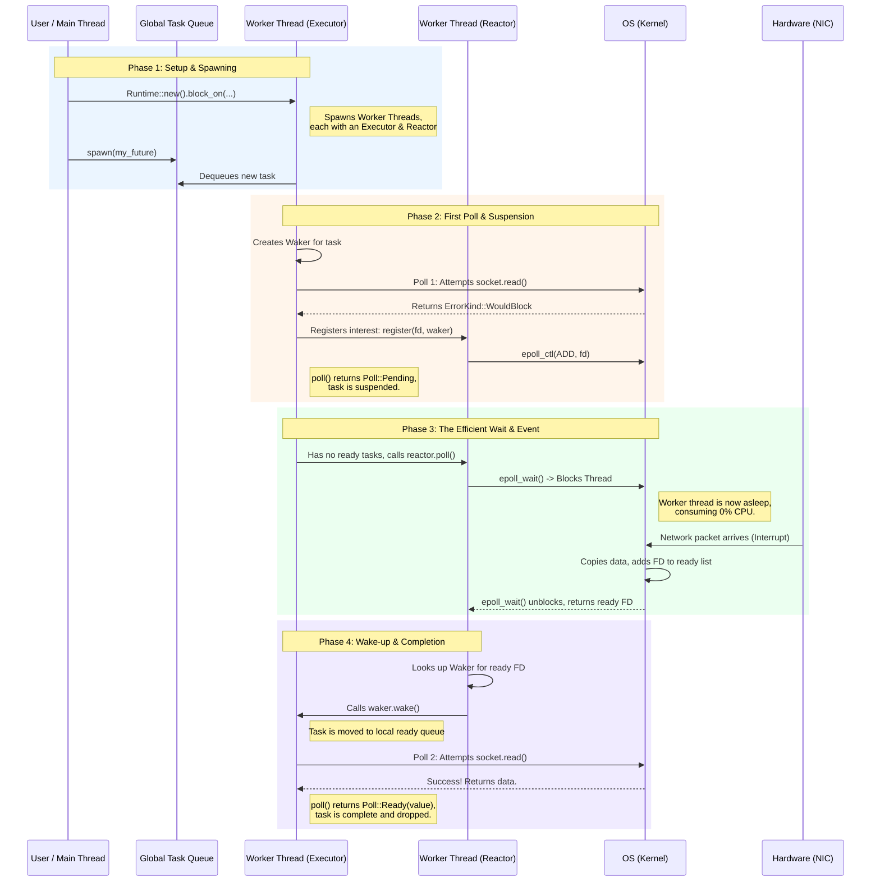

### 1. The Core Problem: The Need for Efficient Waiting

The fundamental goal of async programming is to concurrently handle many I/O-bound tasks (e.g., network requests, database queries) without wasting system resources.

*   **The Naive "Thread-per-Task" Approach (Wasting Memory):**
    *   **What:** Spawning a new OS thread (`std::thread::spawn`) for every incoming connection or task.
    *   **How:** The OS scheduler preemptively switches between threads. If a thread blocks on I/O (e.g., `socket.read()`), the OS puts it to sleep and runs another thread.
    *   **Why It Fails:** OS threads are expensive. Each has its own stack (e.g., 2MB on Linux) and incurs kernel context-switching overhead. This model is infeasible for scaling to tens of thousands of concurrent connections.

*   **The Naive "Busy-Loop" Approach (Wasting CPU):**
    *   **What:** A single-threaded loop that repeatedly calls a non-blocking `try_read()` on all active sockets.
    *   **How:** Sockets are set to non-blocking mode, and the program polls them in a tight loop.
    *   **Why It Fails:** This is a spin lock on I/O. The CPU runs at 100% doing nothing but asking "Are we there yet?", burning power and starving any other potential work.

**The Solution:** We need a mechanism to block a single thread efficiently until *any one* of many I/O sources is ready. This is a job for the operating system.

### 2. The OS-Level Solution: `epoll` (on Linux)

`epoll` is a high-performance I/O event notification interface provided by the Linux kernel. It allows a program to monitor a large number of file descriptors (FDs) and get notifications only for the ones that are ready for I/O.

*   **How it Works (The "Ready List" Model):**
    1.  **Interest List:** You register all the FDs you care about (e.g., 10,000 sockets) with a single `epoll` instance. This is typically a one-time setup per FD.
    2.  **Ready List:** The kernel maintains its own internal "ready list." When an event occurs (e.g., a network packet arrives for a socket), the kernel adds that socket's FD to this list.
    3.  **`epoll_wait()`:** Your program makes a single, blocking system call: `epoll_wait()`. The kernel puts your entire thread to sleep, consuming zero CPU. When the kernel's internal "ready list" becomes non-empty, the syscall unblocks, and the kernel returns to your program *only the list of FDs that are actually ready*.

*   **Why it's Fast (O(1) vs. O(N)):** Older interfaces like `select` and `poll` required you to pass the entire list of 10,000 FDs to the kernel on *every call*. The kernel then had to iterate through all 10,000 to check their status. `epoll` avoids this O(N) scan. The cost of `epoll_wait()` is O(1) with respect to the total number of watched FDs; it's proportional only to the number of *ready* FDs.

*   **How `epoll_wait` Resumes:** The `epoll_wait()` call unblocks as soon as **at least one** of the registered file descriptors has a relevant event. It does not wait for all of them. This is key to efficiency—the goal is to process work as soon as it's available.

*   **Level-Triggered vs. Edge-Triggered:**
    *   **Level-Triggered (LT):** Asks, "Is there unread data in the buffer?" If you check but don't read all the data, `epoll_wait` will immediately wake you up again because the condition ("there is data") is still true.
    *   **Edge-Triggered (ET):** Asks, "Did new data just arrive?" You are notified once when the state changes from "no data" to "has data." You are responsible for reading all of it. If you don't, you won't be notified again until more new data arrives. It's like a doorbell. **Tokio uses ET for higher performance**, as it reduces the number of syscalls.

### 3. The Rust Model: Tasks as Modern Green Threads

Rust builds its async model on top of these OS primitives. The core unit of concurrency is a **Task**.

A **Rust Task** (a `Future` polled by an **Executor**) is the modern equivalent of a **green thread**. It is a lightweight, cooperatively scheduled unit of concurrency that is managed in user-space by the runtime's executor, not by the OS. The key difference is that instead of a task manually calling `yield()`, it "yields" control back to the executor by returning `Poll::Pending` from its `poll` method.

### 4. The Rust Runtime Architecture: Executor & Reactor

A runtime like Tokio builds a sophisticated architecture around `epoll` to manage these tasks.

*   **Main Components:**
    *   **Worker Thread:** A standard OS thread. A runtime spawns a pool of these (e.g., one per CPU core).
    *   **Executor (Thread-Local):** A task scheduler that lives inside each worker thread. Its job is to poll futures that are ready to run. It's the "green thread" scheduler.
    *   **Reactor (Thread-Local):** An I/O event manager that also lives inside each worker thread. It owns the thread's dedicated `epoll` instance and manages communication with the kernel.
    *   **Future:** A state machine representing a unit of asynchronous work. Its `poll` method is the heart of the interaction.
    *   **Waker:** A handle that allows the Reactor (or any other event source) to tell the Executor that a specific task is ready to be polled again.

*   **Why the "Thread-Local" Design?** This design minimizes cross-thread communication and lock contention. A future is often spawned, polled, and woken up all on the same worker thread, which is excellent for performance and CPU cache affinity.

### 5. The Definitive Lifecycle of a Future: A Step-by-Step Walkthrough

This sequence traces a single async I/O task (e.g., reading from a socket) from creation to completion.

#### **Phase 1: Setup & Spawning (The Preparation)**

*   **Step 1: Runtime Initialization**
    *   **What:** The Main Thread creates and starts the async Runtime (e.g., `Runtime::new().unwrap().block_on(...)`).
    *   **Why:** The Runtime spawns a pool of Worker Threads. Inside each worker, it initializes a dedicated, Thread-Local Executor and a Thread-Local Reactor. Each Reactor creates its own independent `epoll` instance. This multi-reactor design is key to scalability.

*   **Step 2: Spawning the Task**
    *   **What:** User code calls `spawn(my_future)`. The Future is sent to a globally accessible, thread-safe task queue.
    *   **Why:** This allows tasks to be submitted from any thread. A signal is sent to the runtime to ensure an idle worker wakes up to check for this new work.

*   **Step 3: Task Acquisition**
    *   **What:** A Worker Thread (Worker-1) pulls the new task from the global queue and moves it to its own private, local ready queue.
    *   **Why:** Using a local queue for active work reduces lock contention on the global queue. The task is now "owned" by Worker-1.

#### **Phase 2: First Poll & Suspension (The Optimistic Attempt)**

*   **Step 4: The First Poll**
    *   **What:** The Executor on Worker-1 takes the Future from its local ready queue, creates a `Waker` linked to this Future's ID, and calls `future.poll(...)`.
    *   **Why:** The runtime proactively polls a new future, hoping it can complete immediately (e.g., data is already buffered). The `Waker` is the future's only link back to the scheduler.

*   **Step 5: The I/O Attempt and `WouldBlock`**
    *   **What:** Inside `poll`, the Future attempts the non-blocking I/O operation (e.g., `socket.read()`). Since no data has arrived yet, the OS returns an error of kind `ErrorKind::WouldBlock`.
    *   **Why:** This is not a true error. It's the OS's signal that the operation cannot complete right now, triggering the async machinery.

*   **Step 6: Registration with the Reactor (The Contract)**
    *   **What:** The Future knows it must wait. It clones the `Waker` and passes it to the Reactor on Worker-1, saying: "Please notify me via this Waker when my socket's FD is ready for reading."
    *   **Why:** This is the fundamental contract of `Poll::Pending`. The Reactor stores the `Waker` (keyed by the FD) and tells its `epoll` instance to start watching the FD.

*   **Step 7: Returning `Poll::Pending`**
    *   **What:** Having registered for a wake-up, the Future's `poll` method returns `Poll::Pending`.
    *   **Why:** The Future signals to the Executor: "I cannot make progress, but I have arranged to be woken up. Do not poll me again until told." The Executor suspends the task.

#### **Phase 3: The Efficient Wait & The Event (The Heart of Async)**

*   **Step 8: The Thread Goes to Sleep**
    *   **What:** The Executor on Worker-1, having no more ready tasks, calls its Reactor's `poll()` method, which drills down to the `epoll_wait()` system call.
    *   **Why:** This is the efficient wait. The OS puts the entire Worker-1 thread to sleep, consuming zero CPU.

*   **Step 9: The Hardware/OS Event Cascade**
    *   **What:** A network packet arrives.
    *   **Why:** The Network Card (NIC) raises an interrupt. The OS kernel's interrupt handler copies the packet data into the socket's kernel buffer. The kernel sees that its `epoll` instance is watching this socket and adds the FD to `epoll`'s internal "ready list." Because the ready list is now non-empty, the `epoll_wait()` system call unblocks.

#### **Phase 4: The Wake-up & Completion (The Payoff)**

*   **Step 10: The Reactor Wakes the Task**
    *   **What:** The Reactor's `poll()` method returns with the list of ready FDs. For our FD, it looks up the corresponding `Waker` in its map and calls `waker.wake()`.
    *   **Why:** This is the bridge from the OS I/O world back to the Rust async world.

*   **Step 11: Rescheduling the Future**
    *   **What:** The `waker.wake()` function sends the suspended Future's ID back to the Executor's local ready queue on Worker-1.
    *   **Why:** This places the task back on the list of "things to do right now."

*   **Step 12: The Final Poll**
    *   **What:** The Executor's main loop, now unblocked, sees the task in its ready queue and polls it again.
    *   **Why:** The Executor is now acting on the notification that the Future can make progress.

*   **Step 13: `Poll::Ready` and Completion**
    *   **What:** Inside this second poll, the call to `socket.read()` succeeds. The Future has completed its work and returns `Poll::Ready(value)`.
    *   **Why:** This signals the end of the Future's lifecycle. The Executor takes the final value, and the Future state machine is dropped, freeing all its resources.

### 6. Deep Dive: Key Supporting Concepts

#### **`futex` and Blocking Primitives**

A `futex` ("Fast User-space Mutex") is a Linux kernel primitive for creating efficient blocking synchronization tools. It allows a thread to sleep until another thread wakes it up by writing to a specific memory address.

*   **The Disaster of `std::sync::Mutex` in Async:** When you call `.lock()` on a contended `std::sync::Mutex`, it makes a `futex` syscall to put the *entire OS worker thread to sleep*. This stalls the Executor and all the hundreds of other tasks it was managing.
*   **The Async Solution (`tokio::sync::Mutex`):** When you `.await` its `lock()` method, it doesn't block the thread. It returns a future that yields `Poll::Pending` and registers its `Waker`. When the mutex is unlocked, it calls the `Waker` to reschedule the waiting task. The worker thread remains free to work on other tasks. **This is the key difference: thread-blocking vs. task-suspension.**

*   **How `channel.recv()` Works: The User-Kernel Dance**
    The `channel.recv()` mechanism is a brilliant example of minimizing OS interaction:
    1.  **The Fast Path (User Space):** When you call `recv()`, it first locks the channel's data structure and checks a flag: "Is there a message?" If yes, it grabs the message, unlocks, and returns immediately. This is incredibly fast and involves zero OS calls.
    2.  **The Slow Path (Syscall to Kernel):** If the channel is empty, it must wait. It performs a `futex` syscall, telling the OS: "Please put me to sleep. Wake me up only when another thread tells you that the value at this specific memory address has changed." When a `.send()` call on another thread adds data, it then makes a corresponding `futex` syscall to wake up the sleeping receiver.

#### **User-Space vs. Kernel-Space Memory**

By default, the OS kernel **cannot** access your program's memory. There is a strict, hardware-enforced barrier between protected kernel space and user space. This is a critical security feature. The *only* time the kernel can access your program's memory is during a **system call (syscall)**.

**Analogy:** You (a user process) cannot walk into a bank vault (kernel space). You go to a teller (the syscall interface) and fill out a form (syscall arguments, including pointers to your memory). The teller verifies everything, goes into the vault on your behalf, and completes the transaction. This is a deliberate, controlled, and secure transaction.

#### **Spurious Wakeups**

A spurious wakeup occurs when a waiting thread is woken up, but the condition it was waiting for is no longer true.

**Analogy:** You're waiting for a pizza delivery. You hear a knock (the wakeup), but when you open the door, no one is there. From your perspective, you woke up for no reason.

This often happens due to a race condition:
1.  The condition becomes true (pizza arrives).
2.  The OS signals your waiting thread to wake up.
3.  *Before your thread can run*, another thread swoops in and makes the condition false again (your roommate grabs the pizza).
4.  Your thread finally runs, checks for the pizza, and finds it's gone.

**The Golden Rule: "Trust, but Verify."** The correct programming pattern is not to "fix" spurious wakeups but to design for them. Always re-check the condition in a loop after being woken up.
`while !condition { wait() }` is the correct and official pattern.

### 7. A Catalog of Async Event Sources in Rust

A `Waker` can be registered to be notified by many different event sources.

1.  **Network I/O Events (The most common)**
    *   **Mechanism:** `epoll` (Linux), `kqueue` (macOS), `IOCP` (Windows).
    *   **Abstractions:** `tokio::net::TcpStream`, `tokio::net::TcpListener`, etc.
    *   **Events:** Readiness for reading (`read().await`), readiness for writing (`write().await`), new incoming connection (`accept().await`).

2.  **Timer and Time-based Events**
    *   **Mechanism:** OS-level timers, often managed efficiently by the runtime in a "timer wheel" data structure.
    *   **Abstractions:** `tokio::time::sleep`, `tokio::time::Interval`, `tokio::time::timeout`.
    *   **Event:** A duration has passed (`sleep(Duration::from_secs(2)).await`).

3.  **Process and Signal Handling Events**
    *   **Mechanism:** Unix signals.
    *   **Abstractions:** `tokio::signal::unix`, `tokio::process::Child`.
    *   **Events:** A child process has exited (`child.wait().await`), a Unix signal was received (`tokio::signal::ctrl_c().await`).

4.  **File System I/O Events (The Special Case)**
    *   **The Problem:** Standard file I/O is a blocking operation on most operating systems and cannot be efficiently integrated with `epoll`.
    *   **The Tokio Workaround:** Tokio maintains a separate pool of blocking threads. When you call `tokio::fs::read("file.txt").await`, the operation is sent to this thread pool. When it completes, the worker thread calls the `Waker` to wake up the original async task. This *simulates* asynchronicity.
    *   **The Modern Exception:** Newer Linux kernels provide `io_uring` for true async file I/O, which is being adopted by crates like `tokio-uring`.

5.  **User-Space Synchronization Events (From other tasks)**
    *   **Mechanism:** In-program data structures that manage their own lists of `Waker`s.
    *   **Abstractions:** `tokio::sync::channel`, `tokio::sync::Mutex`, `tokio::sync::Notify`.
    *   **Events:** A message arrives in a channel (`rx.recv().await`), a mutex is released (`mutex.lock().await`), an explicit notification is sent (`notify.notified().await`).

### 8. Why Async Runtimes Aren't in the Standard Library

A common question is, "If async is so important, why isn't a runtime like Tokio part of the standard library (`std`)?" The answer lies in Rust's philosophy of providing zero-cost abstractions and empowering users without imposing specific implementation choices.

Rust's `std` aims to be platform-agnostic and make as few assumptions as possible. An async runtime, however, is an **opinionated choice** about how to handle fundamental trade-offs:

*   How many threads should be used? One or many?
*   How should tasks be scheduled? A simple queue or a complex work-stealing algorithm?
*   How should I/O be handled? Via `epoll`, `io_uring`, or something else entirely?
*   What are the memory constraints? Is dynamic allocation (`alloc`) even available?

A single runtime cannot be optimal for all use cases. By keeping the runtime separate from the core `Future` trait in `std`, Rust allows the ecosystem to flourish, providing specialized runtimes for different domains.

Here are some examples of different domains and their corresponding runtime choices:

#### **High-Throughput Servers (Web, Databases)**

*   **Requirements:** Needs to handle tens of thousands of concurrent I/O-bound tasks. Performance is critical, so a multi-threaded, work-stealing scheduler is ideal to keep all CPU cores busy.
*   **Key Crates:**
    *   **`tokio`**: The de-facto standard for this domain. It provides a sophisticated multi-threaded scheduler, a high-performance I/O reactor built on **`mio`** (`epoll`/`kqueue`/`iocp`), and a rich ecosystem of utilities (`tokio::sync`, `tokio::time`, etc.).
    *   **`mio`**: A low-level, cross-platform I/O abstraction that provides the non-blocking I/O foundation for Tokio and other runtimes.

#### **Simpler or Single-Threaded Applications (GUI, CLI Tools)**

*   **Requirements:** A complex multi-threaded scheduler can be overkill and add unnecessary overhead. A simpler, single-threaded executor is often sufficient and easier to reason about.
*   **Key Crates:**
    *   **`async-std`**: A runtime that aims to provide an async equivalent of the `std` library. It offers a familiar API and uses a thread-per-core scheduler.
    *   **`smol`**: A smaller, simpler, and highly efficient runtime that can be used to power other executors. It's known for its simplicity and performance in single-threaded or less complex scenarios.

#### **Embedded Systems (`no_std`)**

*   **Requirements:** Extreme resource constraints. Often no OS, no dynamic memory allocation (`alloc`), and a single processor core. The runtime must be `#[no_std]` compatible, have a tiny memory footprint, and be deterministic.
*   **Key Crates:**
    *   **`embassy-rs`**: The leading framework for async embedded Rust. It provides a `#[no_std]` compatible, single-threaded executor specifically designed for microcontrollers. It has excellent abstractions for hardware-specific events like GPIO interrupts, SPI, and I2C, treating them all as awaitable futures.

#### **WebAssembly (WASM)**

*   **Requirements:** Code runs in a browser sandbox. There are no OS threads or `epoll`. All I/O and concurrency must be managed by the browser's single-threaded JavaScript event loop.
*   **Key Crates:**
    *   **`wasm-bindgen-futures`**: The essential bridge between Rust `Future`s and JavaScript `Promise`s. It allows you to `.await` JavaScript operations (like `fetch`) from your Rust code by converting the future into a promise that the browser's event loop can manage.

This separation is a feature, not a limitation. It allows Rust to be a top-tier choice for building a high-performance web server on Linux, a GUI application on Windows, and a real-time motor controller on a tiny microcontroller, all using the same core `async`/`.await` syntax.

***


### 9. Locks usage in async/awaits
Never hold a lock across `.await` point, this means if you are using a `mutex.lock()`, followed by an `.await` and then followed by `mutex.unlock()` then its a disaster.

| Approach                                          | Avoids Deadlock? | Avoids Thread Blocking? | Performance Impact                                                                                                 | Recommendation       |
| ------------------------------------------------- | ---------------- | ----------------------- | ------------------------------------------------------------------------------------------------------------------ | -------------------- |
| std::sync::Mutex held across .await               | **No**           | **No**                  | **Disaster.** Guaranteed deadlock and thread blocking.                                                             | **Never do this.**   |
| std::sync::Mutex with minimal scope (idiomatic)   | **Yes**          | **No**                  | **Performance Killer.** Avoids deadlock but still blocks the thread, starving the executor and hurting throughput. | **Strongly avoid.**  |
| tokio::sync::Mutex held across .await             | **No**           | **Yes**                 | **Logical Error.** Still a deadlock risk, but at least the executor isn't frozen.                                  | **Avoid.**           |
| tokio::sync::Mutex with minimal scope (idiomatic) | **Yes**          | **Yes**                 | **Excellent.** No deadlock risk, no thread blocking. The executor remains fully utilized.                          | **The Correct Way.** |

### Mermaid Sequence Diagram: The Lifecycle of a Future

This diagram visually represents the step-by-step process described in Section 5, showing the interactions between all the key components from task creation to completion.



### Sample Rust Code
```rust
// ===================================================================================
// RUST ASYNC LIFECYCLE - A HIGH-LEVEL OVERVIEW FOR REVISION
// ===================================================================================

use std::collections::HashMap;
use std::future::Future;
use std::pin::Pin;
use std::task::{Context, Poll, Waker};
use mio::{Token}; // `mio` is our stand-in for the OS epoll/kqueue interface

// -----------------------------------------------------------------------------------
// COMPONENT 1: The Future (Our Async Task)
// -----------------------------------------------------------------------------------
// - Represents a single unit of asynchronous work (e.g., reading from a socket).
// - It's a state machine.
// - Its most important method is `poll`.
struct MySocketReadFuture {
    // It holds its own state. e.g., are we reading for the first time or have we been waiting?
    // It holds the resource it needs, like a non-blocking TcpStream.
}

impl Future for MySocketReadFuture {
    type Output = Vec<u8>; // What it will produce when done

    fn poll(self: Pin<&mut Self>, cx: &mut Context<'_>) -> Poll<Self::Output> {
        // The Executor calls this method.

        // PSEUDO-CODE LOGIC:
        // 1. Try the non-blocking I/O operation (e.g., `socket.try_read()`).
        //
        // 2. IF IT SUCCEEDS (data was already there):
        //    - We are done! Return `Poll::Ready(the_data)`.
        //
        // 3. IF IT FAILS WITH `WouldBlock` (OS says "not ready yet"):
        //    - This is the "yield" point of async Rust.
        //    - A. Get the Waker from the Context: `let waker = cx.waker().clone();`
        //    - B. Register for a notification: Tell the REACTOR, "Hey Reactor, here is my
        //         socket (File Descriptor) and my `Waker`. Please call this `Waker` when
        //         my socket becomes readable."
        //    - C. Return `Poll::Pending`. This signals to the Executor: "I can't make
        //         progress now. Please suspend me and don't poll me again until my
        //         Waker is called."
    }
}

// -----------------------------------------------------------------------------------
// COMPONENT 2: The Reactor (The I/O Event Notifier)
// -----------------------------------------------------------------------------------
// - Manages communication with the OS's event system (epoll, kqueue).
// - Its job is to efficiently wait for I/O events.
struct Reactor {
    // Holds the handle to the OS polling mechanism (e.g., `mio::Poll`).
    
    // A map from a unique I/O event identifier (Token) to the Waker of the Future
    // that is waiting for that event.
    // `HashMap<Token, Waker>`
    waker_map: HashMap<Token, Waker>,
}

impl Reactor {
    // Is called by a Future (during its poll) to register interest.
    fn register_interest(&mut self, socket_fd: Token, waker: Waker) {
        // 1. Adds the `waker` to its `waker_map` keyed by the `socket_fd`.
        // 2. Tells `epoll`: "Start watching this `socket_fd` for readability."
    }

    // Is called by the Executor when it has no more work to do.
    fn wait_for_events(&mut self) {
        // 1. Makes a single blocking call to the OS: `epoll_wait()`.
        //    THE ENTIRE THREAD SLEEPS HERE. EFFICIENT WAITING.
        
        // 2. When `epoll_wait()` unblocks, the OS gives it a list of ready FDs.
        
        // 3. For each ready FD (Token):
        //    - Look up the corresponding `Waker` in the `waker_map`.
        //    - Call `waker.wake()`.
    }
}


// -----------------------------------------------------------------------------------
// COMPONENT 3: The Executor (The Task Scheduler)
// -----------------------------------------------------------------------------------
// - The "green thread" scheduler. It drives all Futures to completion.
// - It does NOT know about I/O. It only knows how to poll Futures.
struct Executor {
    // A queue of Futures that are ready to be polled.
    // `VecDeque<Task>` or `mpsc::Receiver<Task>`
    ready_queue: Vec<Task>, // Task is a boxed Future
}

impl Executor {
    fn run(&mut self) {
        // The main event loop.
        // 1. Take a task from the `ready_queue`.
        
        // 2. Create a `Context` containing a `Waker` for that task.
        //    - The `Waker`'s job, when called, is simple: put this task back
        //      onto the `ready_queue`.
        
        // 3. Poll the task: `task.poll(&mut context)`.
        
        // 4. IF the poll returns `Poll::Ready`:
        //    - The task is complete! Drop it.
        
        // 5. IF the poll returns `Poll::Pending`:
        //    - The task has registered itself with the Reactor.
        //    - The Executor does nothing with it. It's now suspended.
        
        // 6. IF the `ready_queue` becomes empty:
        //    - The Executor has no work to do.
        //    - It calls `reactor.wait_for_events()`, which puts the thread to sleep.
        //    - When the reactor returns, some Wakers will have been called, and the
        //      `ready_queue` will have new tasks in it.
        //    - Go back to step 1.
    }
}


// -----------------------------------------------------------------------------------
// COMPONENT 4: The Spawner (The Task Submitter)
// -----------------------------------------------------------------------------------
// - The handle for submitting new tasks to the runtime from anywhere.
struct Spawner {
    // A channel sender to push new tasks into the Executor's ready_queue.
    // `mpsc::Sender<Task>`
    task_sender: Sender<Task>,
    
    // A special Waker that wakes up the *entire Executor*, not just one task.
    // (This is often an `eventfd` or pipe registered with the Reactor).
    runtime_waker: mio::Waker,
}

impl Spawner {
    fn spawn(&self, future: Task) {
        // 1. Send the new `future` to the Executor's `ready_queue` via the `task_sender`.
        
        // 2. Nudge the runtime: `runtime_waker.wake()`.
        //    - This triggers the special `eventfd`/pipe in the Reactor.
        //    - This causes the `epoll_wait()` call in the sleeping Executor/Reactor
        //      to wake up immediately.
        //    - The Executor can now see the new task in its queue and run it.
    }
}

// ===================================================================================
// SUMMARY FLOW
// ===================================================================================
// 1. `spawner.spawn(future)` -> Puts future in Executor's `ready_queue` & wakes Executor.
// 2. `Executor`         -> Polls the `future`.
// 3. `Future`           -> Tries I/O. Gets `WouldBlock`.
// 4. `Future`           -> Registers its `Waker` with the `Reactor`. Returns `Poll::Pending`.
// 5. `Executor`         -> Suspends the future. Runs out of work.
// 6. `Executor`         -> Calls `reactor.wait_for_events()`. Thread sleeps.
// 7. `OS` / `Hardware`  -> I/O event happens. Wakes up the `Reactor`.
// 8. `Reactor`          -> Finds the correct `Waker` and calls `.wake()`.
// 9. `Waker`'s logic    -> Puts the `future` back in the Executor's `ready_queue`.
// 10. `Executor`         -> Wakes up, finds the task, polls it again. This time it returns `Poll::Ready`.
// 11. `Executor`         -> Task is complete.
// ===================================================================================
```

### Patterns of coding in Rust (Data-Flow Questionnaire)

Pull based - Its data consumer controlled model, its about **transformations**.
Pull based - Its data producer controlled model, its about **communications**.
#### Imperative Patterns in Rust
This approach involves direct, hands-on control over loops and communication channels. It's explicit and does exactly what you write, when you write it.

|                  | **Pull-based (Transformative)**                                                                                                                                                                                                                                                                                                                                                                       | **Push-based (Communicative)**                                                                                                                                                                                                                                                                                                                                              |
| :--------------- | :---------------------------------------------------------------------------------------------------------------------------------------------------------------------------------------------------------------------------------------------------------------------------------------------------------------------------------------------------------------------------------------------------- | :-------------------------------------------------------------------------------------------------------------------------------------------------------------------------------------------------------------------------------------------------------------------------------------------------------------------------------------------------------------------------- |
| **Synchronous**  | **Role:** Taking a known sequence of data and transforming it step-by-step.<br/><br/>**Example:** `for item in my_vec.iter() { ... }`<br/><br/>**Evaluation:** Eager<br/>**Pros:** Simple, direct, easy to debug execution flow.<br/>**Cons:** Verbose for complex transformations.<br/>**Performance:** High performance, but can do unnecessary work if the full sequence isn't needed.             | **Role:** Communicating between traditional OS threads.<br/><br/>**Example:** `tx.send(data).unwrap();`<br/><br/>**Evaluation:** Eager<br/>**Pros:** Safe and straightforward inter-thread communication.<br/>**Cons:** Can lead to deadlocks if not designed carefully.<br/>**Performance:** Highly optimized for thread-to-thread messaging. Low overhead.                |
| **Asynchronous** | **Role:** Transforming a sequence of data that arrives over time.<br/><br/>**Example:** `while let Some(item) = my_stream.next().await { ... }`<br/><br/>**Evaluation:** Eagerly pulls from a lazy source.<br/>**Pros:** Integrates perfectly with `async/await`.<br/>**Cons:** Still verbose for chained, conditional logic.<br/>**Performance:** Very high performance with automatic backpressure. | **Role:** Communicating between asynchronous green threads (tasks).<br/><br/>**Example:** `tx.send(data).await.unwrap();`<br/><br/>**Evaluation:** Eager<br/>**Pros:** The standard, robust way to coordinate async tasks.<br/>**Cons:** Requires careful management in complex fan-in/fan-out scenarios.<br/>**Performance:** Highly optimized for task-to-task messaging. |
#### Declarative Patterns in Rust
This approach involves describing _what_ you want to happen by chaining methods together. It's a higher-level, compositional style.

|                  | **Pull-based (Transformative)**                                                                                                                                                                                                                                                                                                                                                                                                 | **Push-based (Communicative)**                                                                                                                                                                                                                                                                                                                                                                                                                                                                                                                                          |
| :--------------- | :------------------------------------------------------------------------------------------------------------------------------------------------------------------------------------------------------------------------------------------------------------------------------------------------------------------------------------------------------------------------------------------------------------------------------ | :---------------------------------------------------------------------------------------------------------------------------------------------------------------------------------------------------------------------------------------------------------------------------------------------------------------------------------------------------------------------------------------------------------------------------------------------------------------------------------------------------------------------------------------------------------------------- |
| **Synchronous**  | **Role:** Declaring a pipeline to transform a sequence of data.<br/><br/>**Example:** `my_vec.iter().map(...).filter(...).collect();`<br/>**Evaluation:** Lazy<br/>**Pros:** Highly readable, composable, and avoids work on unused data.<br/>**Cons:** Can be slightly harder to debug for beginners.<br/>**Performance:** Identical to imperative loops due to zero-cost abstractions. Very low resource use.                 | **Role:** Communicating events to multiple decoupled subscribers.<br/><br/>**Example:** `subject.next(data);`<br/>**Evaluation:** Eager<br/>**Pros:** Excellent for event-bus architectures where the sender is decoupled from receivers.<br/>**Cons:** Niche; adds overhead compared to standard channels.<br/>**Performance:** Slower and more resource-intensive than `mpsc` due to abstraction layers. Due to dynamic dispatch of subjects => heap allocations & no optimizations of the pipelines similar to Iterators getting converted to loops.                 |
| **Asynchronous** | **Role:** Declaring a pipeline to transform an asynchronous sequence.<br/><br/>**Example:** `my_stream.map(...).filter(...).for_each(...).await`<br/>**Evaluation:** Lazy<br/>**Pros:** The idiomatic, clean, and powerful way to handle async data flows.<br/>**Cons:** Can be complex to create your own `Stream` types.<br/>**Performance:** Just as fast as the imperative loop. The premier pattern for async performance. | **Role:** Communicating events between decoupled async components.<br/><br/>**Example:** `Observable::from_iter(...).subscribe(...);`<br/>**Evaluation:** Lazy until `subscribe()` is called.<br/>**Pros:** Very powerful for complex, conditional event correlation.<br/>**Cons:** Not idiomatic in Rust; significant overhead.<br/>**Performance:** Significantly slower and more resource-intensive than Tokio channels.Due to dynamic dispatch of subjects => heap allocations & no optimizations of the pipelines similar to Iterators getting converted to loops. |
#### Why Iterators & Streams are faster than Pushed based RxRust
Observers needs to stored in a Vec - which must be trait objects since we don't know all the observers at the compile time.

1. The need to support heterogeneous (different types of) subscribers forces the use of **trait objects (dyn Observer)**.
2. Trait objects require **heap allocation (Box)** to be stored in a collection.
3. Trait objects require **dynamic dispatch (vtable lookups)** to call their methods.
4. Dynamic dispatch is an **optimization barrier** that prevents the compiler from inlining and fusing the operations into a single efficient loop, unlike the statically-known Iterator chain.